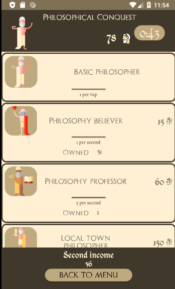

PhilosophicalConquest is a simple game in which you have to gain as much philosophers (money) as you can in the shortest time possible.

Here is the view of the app:

Main menu of an app

These are the rules of the game

You can also choose between game variants

The game

Something like this will show up after you reach the end of your game.

These are the highscores that show up when you get any

